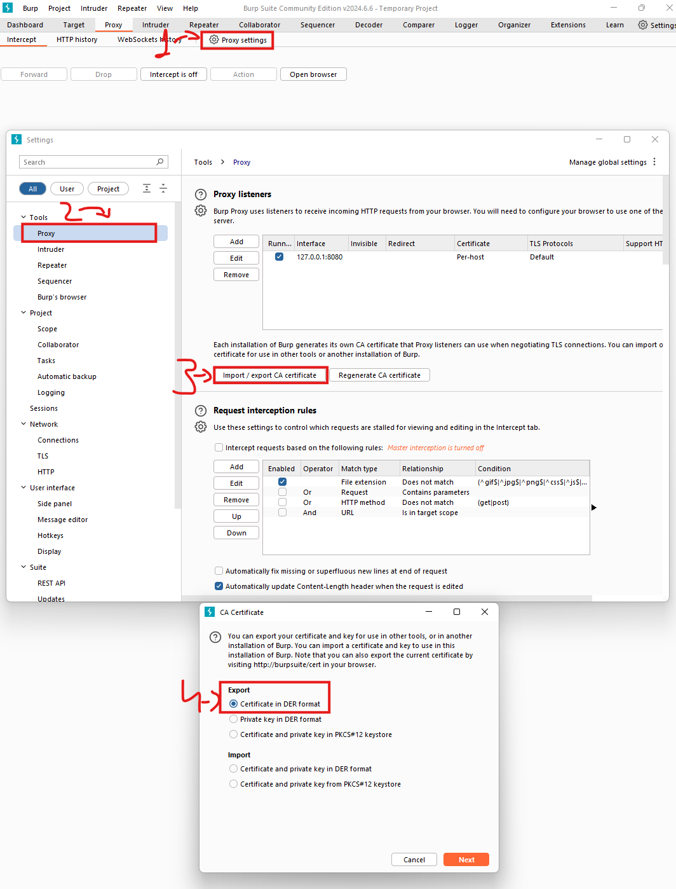
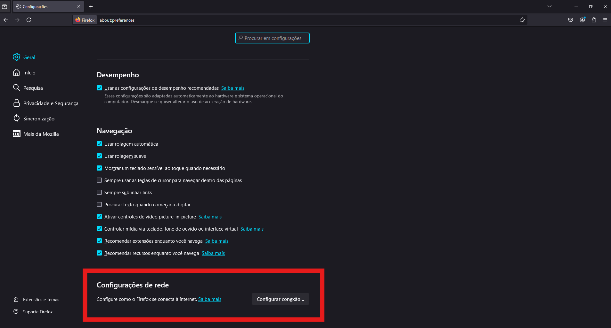
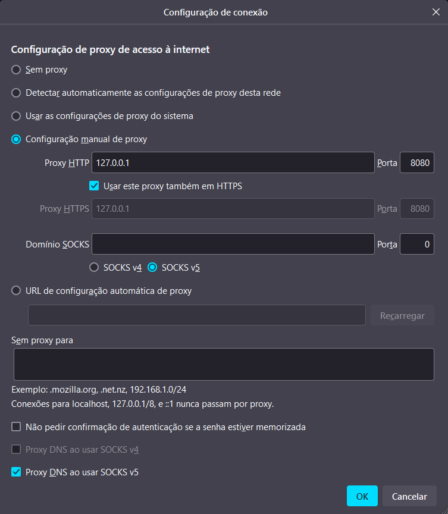
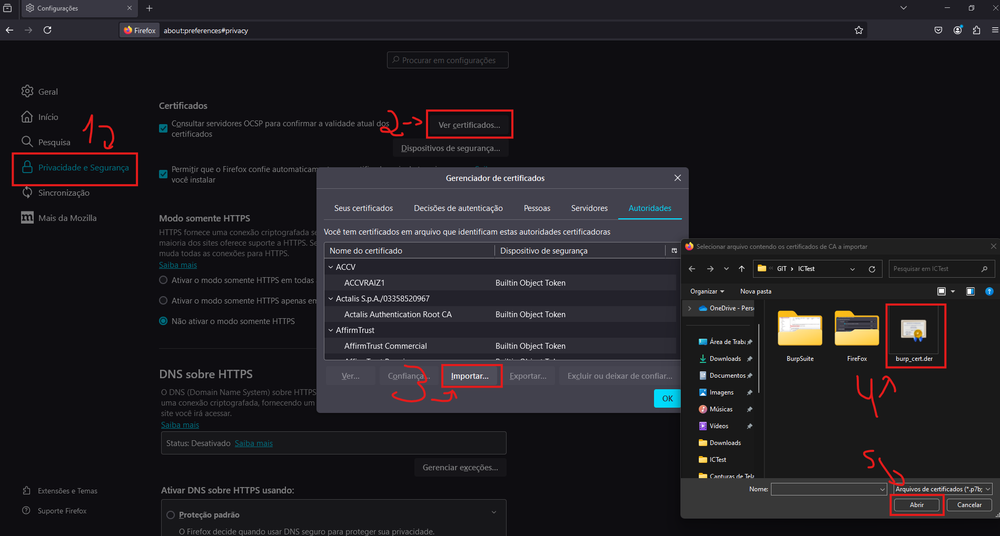
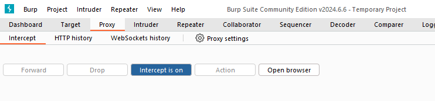
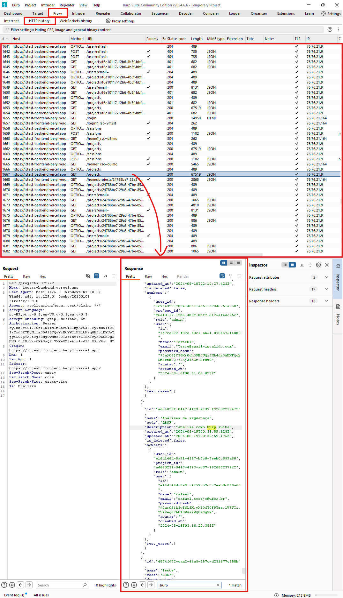
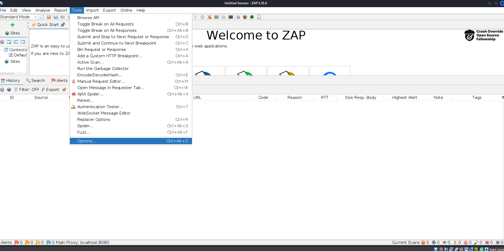
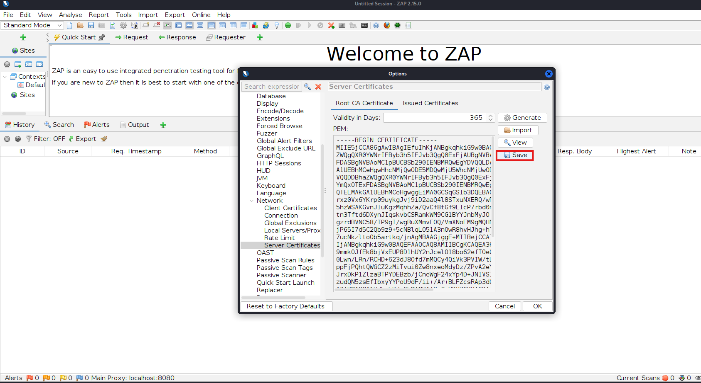
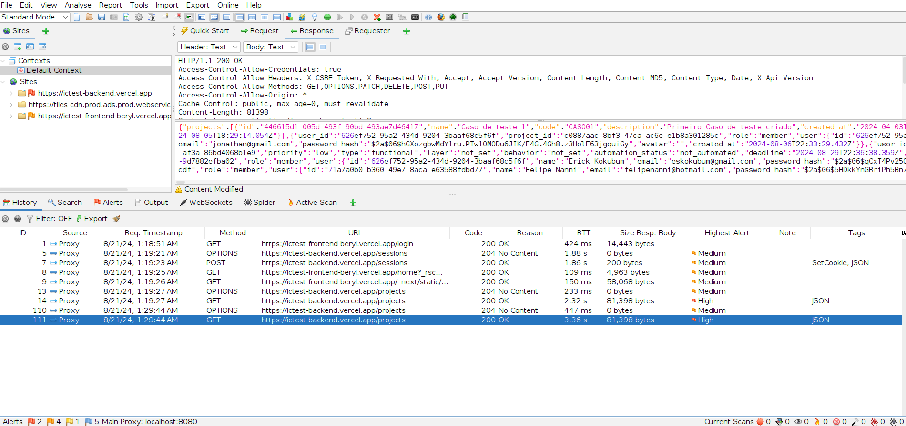
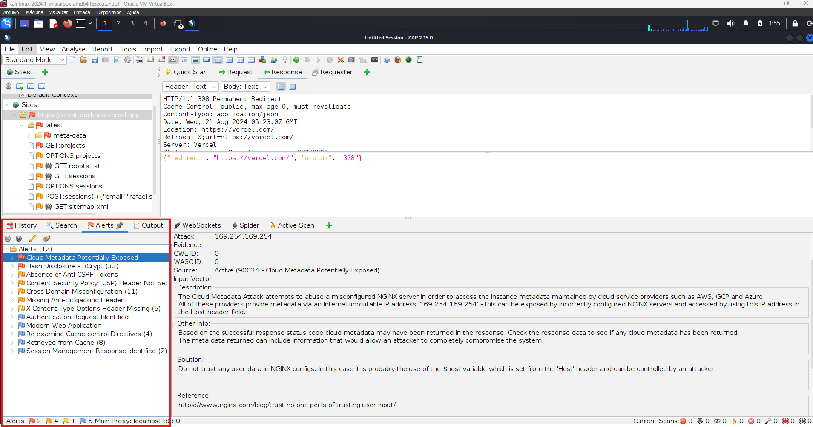

Essa análise foi realizada como parte da disciplina de Engenharia de Software II da Universidade Federal da Bahia.  
A proposta era realizar testes de qualidade da software utilizando a metodologia BlackBox na aplicação web espeficida. Portanto, além de utilizar ferramentas tradicionais busquei dar ênfase nos quesitos de segurança da aplicação.
[Link para o slide](https://docs.google.com/presentation/d/1ods-mhaxFRdc4OdhEsyO2XIr7Mfbl1rttoAGVhv_tnk)

# Ambientes e ferramentas utilizadas

Ambiente: Kali Linux
Ferramentas: nikto, OWASP ZAP e John the Ripper, Firefox

Ambiente: Windows
Ferramenta: Burp Suite e Firefox

### Configurações

A configuração do Burp Suite e OWASP ZAP são bem similares, ambas as ferramentas funcionam como um servidor proxy que examina o tráfego entre o navegador e o servidor web.

Para ambos os casos foram gerados certificados e inseridos no FireFox.

Vamos aos passos!

# 1. Configuração Básica do Burp Suite

Iniciar o Burp Suite:

Abra o Burp Suite na sua máquina Windows. Se estiver usando a versão Community (gratuita), selecione a opção `Temporary Project` e clique em `Next`.
Escolha a opção `Use Burp defaults` e clique em `Start Burp` ou se preferir importe o arquivo de configuração disponibilizado burp-project-settings.json na pasta `BurpSuit` deste repositório.

### Configurar o Proxy no Burp Suite:

#### Exportar certificado 
Vá para a aba Proxy > Options.
Na seção "Proxy Listeners", clique em Import / Export CA Certificate.
Escolha Export Certificate in DER format e salve o certificado em um local de sua escolha.

## 1.2. Configurar o Proxy no Navegador

Você precisa configurar o seu navegador para usar o Burp Suite como proxy

### Configuração do FireFox

Abra o Firefox e vá para as configurações (Menu > Configurações).
Role até encontrar a seção `Configurações de Rede`e clique em `Configurar conexão...`.

Selecione `Configuração manual de proxy`.
No campo "HTTP Proxy", insira 127.0.0.1 e, na porta, coloque 8080.
Certifique-e de marcar o checkbox `Usar este proxy também em HTTPS`

Clique em "OK".

Para inspecionar o tráfego HTTPS Você precisa instalar o certificado CA do Burp Suite no navegador:

No navegador, vá para as configurações de certificados:
Firefox: Configurações > Privacidade e Segurança > Certificados > Ver Certificados.
Importe o certificado que você salvou como uma Autoridade de Certificação (CA) confiável.

## 1.3. Execução do Teste com Burp Suite

No Burp Suite, vá para a aba Proxy e selecione Intercept. Certifique-se de que a interceptação está ativada (botão deve estar em "Intercept is on").

### Navegue pelo Site com o Burp Suite Ativado

Navegue até o site alvo https://ictest-frontend-beryl.vercel.app/ no navegador configurado.
Observe que o Burp Suite irá interceptar as requisições. Você pode examinar e modificar as requisições HTTP antes de enviá-las ao servidor.

# 2. Configuração OWASP ZAP (ZED ATTACK PROXY)

A configuração do OWASP ZAP é bem similar ao do Burp Suite, para seu correto funcionamento o item 1.2 se repete, o que muda é a forma de exportar o certificado.

No Kali Linux, abra o terimnal e execute o comando `sudo apt install zaproxy` para instalar o pacote `zaproxy`. 

O comando `sudo zaproxy` iniciará a ferramenta.

Com a ferramenta aberta, clique em `Tools` > `Options`

Abrirá um novo pop-up, procure a sessão `Network` e depois a opção `Server Certificates`, clique em salvar e escolha a pasta de preferência para guardar o certificado do OWASP ZAP para depois importa-lo no FireFox.

## 2.1. Atacando com OWASP ZAP

Com a ferramenta devidamente configurada, navegue com o FireFox até o o site alvo, no caso `https://ictest-frontend-beryl.vercel.app/` , conforme você for interagindo com o site o histórico das suas requisições vão aparecendo na aba `history` conforme imagem abaixo

Utilizei um ataque automatizado, com os seguintes passos:

na aba sites, selecione o site de interesse, no caso `https://ictest-frontend-beryl.vercel.app/`, clique com botão direito, selecione `Attack` e depois `Spider`, esse "ataque" é não intrusivo e, de forma bem simplificada, serve para mapear todos os links do site de forma automatizada. 

Em seguida utilizei o `Active Scan` que, resumindo, executa testes automatizados de vulnerabilidades e é intrusivo

Após a conclusão dos scans mencionados, já podemos observar algumas vulnerabilidades encontradas na aba `Alerts` 

Foram encontrados 12 aletas de vulnerabilidades, sendo 2 críticos.

1. Cloud Metadata Potencialmente Exposta
2. Divulgação de Hash (BCrypt)

Explorando a `Divulgação de Hash (BCrypt)` e o vazamento de hashes de senhas pelo endpoint `/projects`, é possível comprometer as senhas de qualquer usuário do sistema.

Para isso basta executar 

`john --wordlist=senha.txt --format=bcrypt hash.txt`

john é a chamada da ferramenta John the Ripper, uma ferramenta de cracking de senhas muito popular e poderosa.

Após a conclusão dos testes, esse relatório foi enviado diretamente para o desenvolvedor da ferramenta ICTeste, por e-mail, para que ele possa corrigir as vulnerabilidades encontradas.
