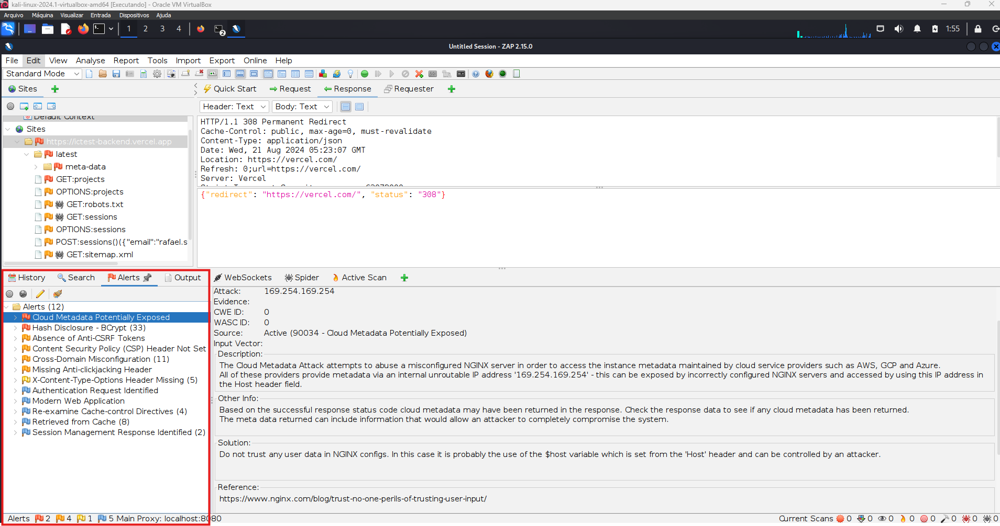

# 1. Introdução
### Objetivo do Documento:

Descrever os testes realizados no sistema ICTest, um protótipo de sistema de gerenciamento de casos de teste. O foco é realizar testes black box abrangentes para identificar possíveis falhas e garantir que as funcionalidades principais do sistema funcionem conforme o esperado.
### Escopo:
Este documento cobre testes funcionais, de usabilidade, e de segurança, realizados em ambiente Windows e Kali Linux.
### Ferramenta de Bug Tracking:
Os bugs identificados serão registrados em um repositório GitHub, usando a seção de issues para detalhar cada problema.

# 2. Metodologia
### Tipo de Testes:
Testes Black Box, sem acesso ao código-fonte.
## Ambiente de Teste:
### Segurança:
Kali Linux
### Testes Gerais:
Windows
### Critérios de Aceitação:
Não há critérios de aceitação bem definidos; os testes buscam identificar o maior número possível de falhas.
# 3. Casos de Teste
# 3.1 Testes funcionais

## Cadastro de Usuário:

### Especificações:
- O campo `nome` deve aceitar apenas caracteres alfabéticos.
- O campo `e-mail` deve aceitar apenas endereços de e-mail válidos.
- O campo `senha` deve exigir uma senha forte (mínimo de 8 caracteres, com números e letras).

### Casos de Teste:

### **CT01**: Cadastro com nome alfabético
- **Pré-condição**: Sistema na tela de cadastro.
- **Entradas**: Nome: `rafael`, E-mail: `rafael.serejo@ufba.br`, Senha: `123qwe`
- **Passos**:
  1. Preencher os campos com os valores indicados.
  2. Submeter o formulário.
- **Resultado Esperado**: O cadastro deve ser rejeitado porque a senha é fraca.
- **Resultado Real**: Cadastro realizado com sucesso.

### Particionamento de Classe de Equivalência:
- **Nome**: 
  - Classe válida: alfabético, ex: `Usuario`
  - Classe inválida: Contém caracteres especiais ou numéricos, ex: `!@#`, `usuario1`, `123`
  - Classe válida: Entre 3 e 50 caracteres
  - Classe inválida: Menos que 3 caracteres
  - Classe inválida: Maior que 50 caracteres
- **E-mail**:
  - Classe válida: Formato correto, ex: `user@example.com`
  - Classe inválida: Formato incorreto, ex: `user@invalid`
  
### Análise de Valor de Fronteira:

### **CT02**: Teste de Limite Inferior
- **Descrição**: Verificar se o sistema rejeita um nome de usuário com menos de 3 caracteres.
- **Entradas**: Nome: `ab` 
- **Resultado Esperado**: O sistema deve rejeitar o cadastro.
- **Resultado Real**: Cadastro realizado com sucesso.

### **CT03**: Teste de Limite Superior
- **Descrição**: Verificar se o sistema aceita um nome de usuário com exatamente 50 caracteres.
- **Entradas**: Nome: `12345678901234567890123456789012345678901234567890` (50 caracteres)
- **Resultado Esperado**: O sistema deve aceitar o cadastro.
- **Resultado Real**: Cadastro realizado com sucesso.

### **CT04**: Teste com Nome Muito Longo
- **Descrição**: Verificar se o sistema rejeita um nome de usuário com mais de 50 caracteres.
- **Entradas**: Nome: `123456789012345678901234567890123456789012345678901` (51 caracteres)
- **Resultado Esperado**: O sistema deve rejeitar o cadastro.
- **Resultado Real**: Cadastro realizado com sucesso.

### Oráculo de Teste:
- **Critério**: Cadastro deve ser rejeitado se o e-mail for inválido, a senha não for forte e o nome tiver números ou caracteres especial e/ou estiver fora da faixa entre 3 e 50 caracteres.

Comportamento de redirecionamento para tela de login, após cadastro, efetuada com sucesso. 

#### inputs testados:

```
nome:   rafael
e-mail: rafael.serejo@ufba.br
senha:  123qwe

nome:   Teste
e-mail: teste@email-invalido.com
senha:  123456

nome:   123
e-mail: 123@123.com
senha:  123qwe

nome:   !@#
e-mail: qwe@qwe.com
senha:  123456
```

Os bugs encontrados no formulário de cadastro são críticos pois permitem ataques de Buffer OverFlow e DoS, uma vez que o campo `nome` aceita uma string com mais de 1.000.000 de caracteres, permitir senhas fracas como 123456 e 123qwe também implicam em vulnerabilidades severas de segurança.

## Login de Usuário:

### Especificações:

- O sistema deve autenticar usuários com credenciais válidas e rejeitar tentativas de login com credenciais inválidas.
- Se o usuário não estiver cadastrado, uma mensagem clara deve ser exibida.

### Casos de Teste:
### **CT05**: Login com Credenciais Válidas

- **Descrição**: Verificar se o sistema permite o login com e-mail e senha válidos.
- **Pré-condições**: Usuário previamente cadastrado no sistema.
- **Entradas**: E-mail: rafael.serejo@ufba.br, Senha: 123qwe
- **Passos**:
  1. Acessar a tela de login.
  2. Inserir as credenciais válidas.
  3. Clicar no botão "Entrar".
- **Resultado Esperado**: O login é efetuado com sucesso e o usuário é redirecionado para a página inicial.
- **Resultado Real**: O login é efetuado com sucesso e o usuário é redirecionado para a página inicial.

### **CT06**: Login com Credenciais Inválidas

- **Descrição**: Verificar se o sistema rejeita o login com e-mail ou senha inválidos.
- **Pré-condições**: Usuário cadastrado no sistema.
- **Entradas**: E-mail: rafael.serejo@ufba.br, Senha: 123qw1
- **Passos**:
  1. Acessar a tela de login.
  2. Inserir o e-mail válido e uma senha inválida.
  3. Clicar no botão "Entrar".
- **Resultado Esperado**: O sistema exibe a mensagem `Email/senha incorreto, tente novamente!`.
- **Resultado Real**: O sistema exibe a mensagem `Email/senha incorreto, tente novamente!`.
### **CT07**: Login com Usuário Não Cadastrado

- **Descrição**: Verificar se o sistema exibe uma mensagem adequada ao tentar logar com um e-mail que não está cadastrado.
- **Pré-condições**: E-mail não cadastrado no sistema.
- **Entradas**: E-mail: email@nao.cadastrado, Senha: 123qwe
- **Passos**:
  1. Acessar a tela de login.
  2. Inserir um e-mail não cadastrado e qualquer senha.
  3. Clicar no botão "Entrar".
- **Resultado Esperado:** O sistema exibe a mensagem Usuário não cadastrado.
- **Resultado Real**: O sistema exibe a mensagem Email/senha incorreto, tente novamente!.

**Recomendação: Atualizar a mensagem em caso de usuário não cadastrado**

## Criação de Projeto:

### Especificações:
- O sistema deve permitir a criação de projetos com um nome único, descrição, e código.
- O nome do projeto deve ser único e limitado a um número razoável de caracteres.
- A descrição do projeto deve ser visível após a criação.
- Não deve ser possível criar projetos duplicados (mesmo nome e código).
- O sistema deve oferecer uma maneira de deletar projetos.

## Casos de Teste:

### **CT08**: Criação de Projeto com Nome, Descrição e Código Válidos
- **Descrição**: Verificar se o sistema permite a criação de um projeto com nome, descrição e código válidos.  
- **Entradas**: Nome: `Procurando bugs`, Descrição: `Projeto para procurar bugs`, Código: `RBSF0001`  
- **Passos**:
  1. Clicar no botão ``Criar Projeto``.
  2. Inserir os dados de nome, descrição e código.
  3. Clicar no botão "Criar Projeto".  
- **Resultado Esperado**: O projeto é criado com sucesso, e a descrição é visível no painel do projeto.
- **Resultado Real**: O projeto é criado com sucesso, e a descrição é nãp é visível no painel do projeto.

### **CT09**: Criação de Projeto com Nome Duplicado
- **Descrição**: Verificar se o sistema rejeita a criação de um projeto com nome duplicado.  
- **Entradas**: Nome: `Descrição`, Descrição: `Não consigo visualizar a descrição do projeto após a criação.`, Código: `RBSF0002`  
- **Passos**:
  1. Clicar no botão ``Criar Projeto``.
  2. Inserir um nome e código já utilizados em outro projeto.
  3. Clicar no botão ``Criar Projeto``.  
- **Resultado Esperado**: O sistema deve rejeitar a criação do projeto, exibindo uma mensagem de erro sobre a duplicação de nome ou código.
- **Resultado Real**: O projeto é criado com sucesso.


### **CT10**: Criação de Projeto com Nome Extenso
- **Descrição**: Verificar se o sistema permite a criação de um projeto com nome extremamente longo e analisar o comportamento.  
- **Entradas**: Nome: `1234567890` repetido 6 vezes, Descrição: `Testando limite de caracteres`, Código: `RBSF00005`  
- **Passos**:
  1. Clicar no botão ``Criar Projeto``.
  2. Inserir um nome de projeto com mais de 1000 caracteres.
  3. Clicar no botão ``Criar Projeto``.  
- **Resultado Esperado**: O sistema deve rejeitar a criação do projeto devido ao nome excessivamente longo ou limitar a entrada de caracteres no campo nome.
- **Resultado Real**: O projeto é criado com sucesso.

### 3 Problemas Identificados:
- **Visualização da Descrição**: Após a criação do projeto, a descrição inserida não é exibida corretamente no painel do projeto, o que pode causar confusão aos usuários.
- **Criação de Projetos Duplicados**: O sistema permite a criação de projetos com nomes e códigos duplicados, o que pode levar a inconsistências nos dados.
- **Limitação de Caracteres**: O campo "Nome" não possui uma limitação de caracteres, permitindo nomes excessivamente longos, o que não é ideal para a usabilidade do sistema.

### Recomendações:
- **Implementar Validação**: Adicionar validação para impedir a criação de projetos com nomes ou códigos duplicados.
- **Limitar o Número de Caracteres**: Introduzir uma limitação de caracteres no campo "Nome" para evitar problemas de interface e usabilidade.
- **Corrigir Visualização**: Garantir que a descrição do projeto seja visível após a criação no painel do projeto.

#### inputs testados:

```
nome:           Procurando bugs
descrição:      Projeto para procurar bugs
código:         RBSF0001

nome:           Descrição
descrição:      Não consigo visualizar a descrição do projeto após a criação.
código:         RBSF0002

nome:           Descrição
descrição:      Não consigo visualizar a descrição do projeto após a criação.
código:         RBSF0002

```

## Criação de Caso de Teste:

### Especificações:
- O sistema deve permitir a criação de casos de teste com um título, descrição, tipo de teste, responsável, prazo e prioridade.
- O campo `nome` deve aceitar um número razoável de caracteres, com uma limitação para evitar strings excessivamente longas.

### Casos de Teste:

### **CT11**: Criação de Caso de Teste com Entradas Válidas
- **Descrição**: Verificar se o sistema permite a criação de um caso de teste com todas as entradas válidas.  
- **Entradas**: 
  - Título: `Cadastro com e-mail inválido`
  - Descrição: `Foi testado se a plataforma aceitaria um email inválido`
  - Tipo de teste: `Funcional`
  - Responsável: `Teste01`
  - Prazo: `2024-08-15`
  - Prioridade: `Média`
  - Anexos: 
- **Passos**:
  1. Clicar no botão "Criar Caso de Teste"
  2. Preencher todos os campos com os dados fornecidos.
  3. Clicar no botão "Criar Caso de Teste".
- **Resultado Esperado**: O caso de teste é criado com sucesso e exibido na lista de casos de teste.
- **Resultado Real**: O caso de teste é criado com sucesso.

**BUG**: O campo `nome` aceita strings muito grandes, o que pode levar a problemas de desempenho e usabilidade.

## Atualização de Caso de Teste

### Especificações:
- O sistema deve permitir a atualização de casos de teste, incluindo a modificação do status e o conteúdo dos campos.

### Casos de Teste:

### **CT12**: Atualização de Caso de Teste por Usuário Autorizado
- **Descrição**: Verificar se um usuário autorizado consegue alterar o status e o conteúdo de um caso de teste.  
- **Passos**:
  1. Login com um usuário autorizado.
  2. Acessar o projeto correspondente.
  3. Selecionar um caso de teste.
  4. Modificar o status e o conteúdo do caso de teste.
  5. Salvar as alterações.
- **Resultado Esperado**: O status e o conteúdo do caso de teste são atualizados com sucesso.
- **Resultado Real**: O status e o conteúdo do caso de teste são atualizados com sucesso.

**BUG**: Qualquer usuário, mesmo sem estar vinculado ao projeto, consegue atualizar um caso de teste.

### Exclusão de Caso de Teste

### Especificações:
- O sistema deve permitir a exclusão de casos de teste apenas por usuários autorizados e vinculados ao projeto.

### Casos de Teste:

### **CT13**: Exclusão de Caso de Teste por Usuário Não Autorizado
- **Descrição**: Verificar se um usuário não autorizado consegue excluir um caso de teste de outro projeto.  
- **Passos**:
  1. Login com um usuário que não faz parte do projeto.
  2. Acessar a lista de projetos.
  3. Selecionar um projeto do qual o usuário não faz parte.
  4. Selecionar qualquer caso de teste dentro do projeto.
  5. Clicar no ícone de lixeira para excluir o caso de teste.
- **Resultado Esperado**: O sistema deve impedir a exclusão do caso de teste e exibir uma mensagem de erro.
- **Resultado Real**: O usuário consegue excluir o caso de teste, mesmo sem fazer parte do projeto.
Casos de teste são criados perfeitamente, fácil e intuitivamente

#### inputs testados:

```
Título: Cadastro com e-mail inválido 
Descrição: Foi testado na se a plataforma aceitaria um email inválido 
Tipo de teste: Funcional
Responsável: Teste01
Prazo: 2024-08-15
Prioridade: Média
Anexos: 
```

### Gerenciamento de Membros no Projeto:

### Especificações:
- O sistema deve permitir a adição e exclusão de membros ao projeto, garantindo que apenas usuários autorizados possam realizar essas ações.
- Os membros adicionados devem ter acesso imediato ao projeto, e a exclusão deve revogar imediatamente o acesso ao projeto.

### Casos de Teste:

### **CT14**: Adição de Membro ao Projeto
- **Descrição**: Verificar se o sistema permite a adição de um novo membro ao projeto com sucesso.
- **Entradas**: E-mail do usuário a ser adicionado.
- **Passos**:
  1. Estar logado.
  1. Acessar a aba ```Meus Projetos``.
  1. Selecionar um projeto.
  1. Dentro do projeto, selecionar a aba ``Memebros``
  2. Inserir o e-mail do usuário que será adicionado.
  3. Clicar no botão "Adicionar Membro".
- **Resultado Esperado**: O membro é adicionado ao projeto com sucesso e aparece na lista de membros.
- **Resultado Real**: A ação é realizada com sucesso.

### **CT15**: Exclusão de Membro do Projeto
- **Descrição**: Verificar se o sistema permite a exclusão de um membro do projeto com sucesso.
- **Entradas**: E-mail do usuário a ser removido.
- **Passos**:
  1. Estar logado.
  1. Acessar a aba ```Meus Projetos``.
  1. Selecionar um projeto.
  1. Dentro do projeto, selecionar a aba ``Memebros``
  2. Selecionar o membro a ser removido.
  3. Clicar no botão "Excluir Membro" (símbolo de lixeira).
- **Resultado Esperado**: O membro é removido do projeto e seu acesso é revogado imediatamente.
- **Resultado Real**: A ação é realizada com sucesso.


## 3.2 Testes de Usabilidade

### Navegação pelo Sistema

### Especificações:
- O sistema deve proporcionar uma navegação intuitiva, com todas as funcionalidades principais facilmente acessíveis pelos usuários.
- Botões e links críticos, como "Esqueci minha senha" e "Excluir Projeto", devem estar presentes e visíveis nas áreas apropriadas da interface.

### Casos de Teste:

### **CT16**: Verificação da Navegação Intuitiva
- **Descrição**: Avaliar se as funcionalidades principais do sistema são facilmente acessíveis e utilizáveis.
- **Passos**:
  1. Navegar por todas as seções principais do sistema.
- **Resultado Esperado**: Todas as funcionalidades principais são facilmente encontradas
- **Resultado Real**: 
  - **Botão de Esqueci minha senha**: Não foi localizado.
  - **Opção para Excluir Projeto**: Não foi localizada.
  - **Intuitividade**: Demais funcionalidades são bem intuitivas e de fácil uso.

### **CT22**: Transição de Estado de "Aberto" para "Em Progresso"
- **Descrição**: Verificar se o sistema permite a transição do status de um caso de teste de "Aberto" para "Em Progresso" através de drag-and-drop.
- **Pré-condições**: Caso de teste no estado "Aberto".
- **Passos**:
  1. Acessar a página do projeto.
  2. Selecionar um caso de teste com status "Aberto".
  3. Arrastar o caso de teste e soltá-lo na coluna "Em Progresso".
- **Resultado Esperado**: O status do caso de teste é atualizado para "Em Progresso"
- **Resultado Real**: O status do caso de teste é atualizado para "Em Progresso"
### **CT23**: Transição de Estado de "Em Progresso" para "Sucesso"
- **Descrição**: Verificar se o sistema permite a transição do status de um caso de teste de "Em Progresso" para "Sucesso" através de drag-and-drop.
- **Pré-condições**: Caso de teste no estado "Em Progresso".
- **Passos:**
  1. Acessar a página do projeto.
  2. Selecionar um caso de teste com status "Em Progresso".
  3. Arrastar o caso de teste e soltá-lo na coluna "Sucesso".
- **Resultado Esperado**: O status do caso de teste é atualizado para "Sucesso"
**Resultado Real**: O status do caso de teste é atualizado para "Sucesso"

### **CT24**: Transição de Estado de "Sucesso" para "Erro"
- **Descrição**: Verificar se o sistema permite a transição do status de um caso de teste de "Sucesso" para "Erro" através de drag-and-drop.
- **Pré-condições**: Caso de teste no estado "Sucesso".
- **Passos:**
  - Acessar a página do projeto.
  -Selecionar um caso de teste com status "Sucesso".
  - Arrastar o caso de teste e soltá-lo na coluna "Erro".
- **Resultado Esperado**: O status do caso de teste é atualizado para "Erro".
- **Resultado Real**: O status do caso de teste é atualizado para "Erro".

## 3.4 Teste Baseado em Cenário para Integração de Funcionalidades
- **Cenário-01**: Criação de Projeto, Adição de Membros e Criação de Caso de Teste
- **Especificações**:
O sistema deve permitir a criação de um projeto, adição de membros ao projeto e a criação de casos de teste dentro de um fluxo contínuo e integrado.
- **Casos de Teste Baseados em Cenário:**
## **CT25:** Fluxo de Trabalho - Criação de Projeto, Adição de Membros e Criação de Caso de Teste
- **Descrição**: Testar o fluxo de trabalho completo desde a criação de um projeto até a criação de um caso de teste, incluindo a adição de membros ao projeto.
- **Passos:**
  1. Criar um novo projeto com nome, descrição e código válidos.
  2. Adicionar membros ao projeto.
  3. Criar um caso de teste dentro do projeto recém-criado.
- **Resultado Esperado**: O projeto é criado com sucesso, os membros são adicionados corretamente, e o caso de teste é criado e associado ao projeto.
- **Resultado Real:** O projeto é criado com sucesso, os membros são adicionados corretamente, e o caso de teste é criado e associado ao projeto.

- **Cenário-02**: Criação de Projeto, Adição de Membros, Criação de Caso de Teste, Deletar Caso de Teste, Remover membro, Excluir projeto
- **Especificações**:
O sistema deve permitir a criação de um projeto, adição de membros ao projeto, criação de casos de teste, deleção de um caso de teste, remoção de um membro e deleção de um projeto dentro de um fluxo contínuo e integrado.
- **Casos de Teste Baseados em Cenário:**
## **CT26:** Fluxo de Trabalho Completo - Criação/Remoção de Projeto, Adição/Remoção de Membros e Criação/Remoção de Caso de Teste
- **Descrição**: Testar o fluxo de trabalho completo desde a criação de um projeto até a criação de um caso de teste, incluindo a adição de membros ao projeto e posteriomente a deleção de todos os itens criados.
- **Passos:**
  1. Criar um novo projeto com nome, descrição e código válidos.
  2. Adicionar membros ao projeto.
  3. Criar um caso de teste dentro do projeto recém-criado.
  3. Apagar um caso de teste
  3. Remover um membro
  3. Apagar um projeto
- **Resultado Esperado**: O projeto é criado com sucesso, os membros são adicionados corretamente, e o caso de teste é criado e associado ao projeto, o caso de teste é deletado, o membro é removido e o projeto é excluído.
- **Resultado Real:** O projeto é criado com sucesso, os membros são adicionados corretamente, e o caso de teste é criado e associado ao projeto, o caso de teste é deletado, o membro é removido e não existe botão para exclusão do projeto.


## 3.5 Testes de Segurança

### Especificações:
- Teste abrangente, buscando o maior númnero de vulnerabilidades

### Casos de Teste:

### **CT17**: Teste de Validação de Campos contra DoS e Buffer Overflow
- **Descrição**: Verificar se o sistema valida corretamente o número máximo de caracteres nos campos de entrada para prevenir ataques de DoS e buffer overflow.
- **Entradas**: Strings excessivamente longas em campos como `nome`.
- **Passos**:
  1. Inserir uma string com mais de 1.000.000 de caracteres no campo `nome`.
  2. Submeter o formulário de cadastro.
- **Resultado Esperado**: O sistema deve rejeitar a entrada com uma mensagem de erro apropriada.
- **Resultado Real**: O sistema aceita a entrada, o que pode levar a vulnerabilidades de DoS e buffer overflow.

### **CT18**: Teste de Injeção SQL
- **Descrição**: Verificar se o sistema está protegido contra injeção de SQL.
- **Ferramenta Utilizada**: sqlmap 1.8.2#stable
- **Passos**:
  1. Executar o sqlmap contra o campo de entrada de dados.
- **Resultado Esperado**: O sistema deve proteger contra SQLi, sem retorno de dados não autorizados.
- **Resultado Real**: O sistema aparenta ter um nível de proteção aceitável contra SQLi.

### **CT19**: Teste de Cross-Site Scripting (XSS)
- **Descrição**: Verificar se o sistema está vulnerável a ataques de XSS devido à falta de configuração da Política de Segurança de Conteúdo (CSP).
- **Passos**:
  1. Inspecionar o cabeçalho HTTP para verificar a presença do cabeçalho CSP.
- **Resultado Esperado**: O cabeçalho CSP deve estar configurado para mitigar o risco de XSS.
- **Resultado Real**: O cabeçalho CSP não está configurado, deixando o site vulnerável a injeção de conteúdo malicioso.
- **Solução**: Configure o cabeçalho CSP para mitigar o risco de XSS e outros ataques de injeção de conteúdo.

### **CT20**: Verificação de Cabeçalhos de Segurança
- **Descrição**: Verificar a presença de cabeçalhos de segurança críticos.
- **Passos**:
  1. Inspecionar as respostas HTTP para verificar os seguintes cabeçalhos:
     - **X-Content-Type-Options**
     - **Anti-Clickjacking**
     - **Timestamp Disclosure - Unix** (já corrigido pelo desenvolvedor)
- **Resultado Esperado**: Todos os cabeçalhos de segurança devem estar presentes.
- **Resultado Real**:
  - **X-Content-Type-Options Header**: Ausente, o que pode permitir ataques de MIME sniffing.
  - **Anti-Clickjacking Header**: Ausente, o que deixa o site vulnerável a ataques de clickjacking.

### **CT21**: Análise de Autenticação e Exposição de Dados Sensíveis
- **Descrição**: Verificar se o sistema protege informações sensíveis durante o processo de autenticação e ao acessar páginas protegidas.
- **Ferramenta Utilizada**: Burp Suite


- **Passos**:
  1. Utilizar o Burp Suite como proxy e capturar as requisições durante o processo de login.
  2. Analisar as respostas HTTP para verificar a exposição de dados sensíveis.
- **Resultado Esperado**: O sistema não deve expor hashes de senhas ou outras informações sensíveis.
- **Resultado Real**: Ao solicitar o GET da página `projects`, a resposta JSON contém a lista de todos os usuários com o `hash_password` de cada um deles, o que é uma vulnerabilidade crítica.

---

### **Problemas Identificados:**
- **Possibilidade de DoS e Buffer Overflow**: O campo `nome` aceita strings com mais de 1.000.000 de caracteres, sem validação adequada.
- **Falta de Configuração CSP**: O site não configurou a Política de Segurança de Conteúdo (CSP), permitindo potenciais ataques de XSS.
- **Ausência de Cabeçalhos de Segurança**:
  - **X-Content-Type-Options**: Ausente, permitindo ataques de MIME sniffing.
  - **Anti-Clickjacking**: Ausente, expondo o site a ataques de clickjacking.
- **Exposição de Dados Sensíveis**: Hashes de senha são expostos em respostas JSON, o que pode levar a ataques de quebra de senha.

### **Recomendações:**
- **Implementar Limitações de Entrada**: Adicionar validação para limitar o número de caracteres permitidos em campos de entrada para prevenir DoS e buffer overflow.
- **Configurar Cabeçalho CSP**: Adicionar a Política de Segurança de Conteúdo (CSP) para mitigar riscos de XSS.
- **Adicionar Cabeçalhos de Segurança**: Configurar os cabeçalhos `X-Content-Type-Options` e `Anti-Clickjacking`.
- **Corrigir Exposição de Dados Sensíveis**: Garantir que dados como hashes de senhas não sejam expostos em respostas HTTP.

### Vulnerabilidades Identificadas dia 20/08/2024:

Ferramenta: OWASP ZAP

1. **Cloud Metadata Potentially Exposed**  
   - **Severidade**: Alta  
   - **Descrição**: Tentativa de abuso de um servidor NGINX mal configurado para acessar metadados da instância mantida por provedores de nuvem.  
   - **Referência**: [Nginx Blog - Trust No One: The Perils of Trusting User Input](https://www.nginx.com/blog/trust-no-one-perils-of-trusting-user-input/)

2. **Hash Disclosure - BCrypt (33)**  
   - **Severidade**: Alta  
   - **Descrição**: Exposição de hashes BCrypt, que pode permitir que um invasor tente quebrar as senhas.  
   - **Referência**: [OWASP - Cryptographic Storage](https://owasp.org/www-community/cryptographic-storage)

3. **Absence of Anti-CSRF Tokens**  
   - **Severidade**: Alta  
   - **Descrição**: Ausência de tokens Anti-CSRF, que protege contra ataques de Cross-Site Request Forgery (CSRF).  
   - **Referência**: [OWASP - Cross-Site Request Forgery (CSRF)](https://owasp.org/www-community/attacks/csrf)

4. **Content Security Policy (CSP) Header Not Set**  
   - **Severidade**: Média  
   - **Descrição**: O cabeçalho CSP não está configurado, o que pode permitir ataques de injeção de conteúdo malicioso (XSS).  
   - **Referência**: [MDN Web Docs - Content Security Policy (CSP)](https://developer.mozilla.org/en-US/docs/Web/HTTP/CSP)

5. **Cross-Domain Misconfiguration (11)**  
   - **Severidade**: Média  
   - **Descrição**: Configuração incorreta de política entre domínios, potencialmente permitindo que recursos sejam compartilhados indevidamente entre diferentes origens.  
   - **Referência**: [OWASP - Cross-Domain Misconfiguration](https://owasp.org/www-community/attacks/Domain-Based_Logic_Attacks)

6. **Missing Anti-clickjacking Header**  
   - **Severidade**: Alta  
   - **Descrição**: Ausência de cabeçalho de proteção contra ataques de clickjacking.  
   - **Referência**: [OWASP - Clickjacking](https://owasp.org/www-community/attacks/Clickjacking)

7. **X-Content-Type-Options Header Missing (5)**  
   - **Severidade**: Média  
   - **Descrição**: Ausência do cabeçalho X-Content-Type-Options, o que pode permitir ataques de MIME sniffing.  
   - **Referência**: [MDN Web Docs - X-Content-Type-Options](https://developer.mozilla.org/en-US/docs/Web/HTTP/Headers/X-Content-Type-Options)

8. **Authentication Related Information Exposed**  
   - **Severidade**: Alta  
   - **Descrição**: Exposição de informações relacionadas à autenticação, como hashes de senhas ou outros dados sensíveis.  
   - **Referência**: [OWASP - Authentication Cheat Sheet](https://cheatsheetseries.owasp.org/cheatsheets/Authentication_Cheat_Sheet.html)

9. **Modern Web Application**  
   - **Severidade**: Informativa  
   - **Descrição**: Identificação do aplicativo como uma aplicação web moderna; geralmente usada para fins informativos e não implica uma vulnerabilidade direta.  
   - **Referência**: [OWASP - Modern Web Application](https://owasp.org/www-project-modern-web-application/)

10. **Re-examine Cache-control Directives (4)**  
    - **Severidade**: Média  
    - **Descrição**: Diretivas de controle de cache inadequadas que podem permitir o armazenamento em cache de conteúdo sensível.  
    - **Referência**: [OWASP - Caching Rules](https://owasp.org/www-project-secure-headers/#http-caching-rules)

11. **Retrieved from Cache (8)**  
    - **Severidade**: Média  
    - **Descrição**: Conteúdo sensível pode ser recuperado do cache, o que pode representar riscos de segurança.  
    - **Referência**: [OWASP - Caching Rules](https://owasp.org/www-project-secure-headers/#http-caching-rules)

12. **Session Management Response Identified (2)**  
    - **Severidade**: Média  
    - **Descrição**: Respostas relacionadas ao gerenciamento de sessão identificadas, o que pode indicar possíveis vulnerabilidades no gerenciamento de sessão.  
    - **Referência**: [OWASP - Session Management Cheat Sheet](https://cheatsheetseries.owasp.org/cheatsheets/Session_Management_Cheat_Sheet.html)